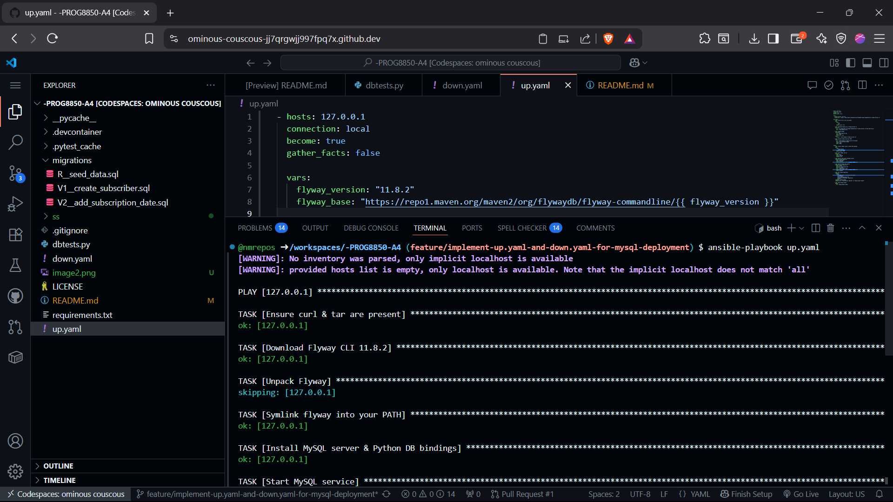
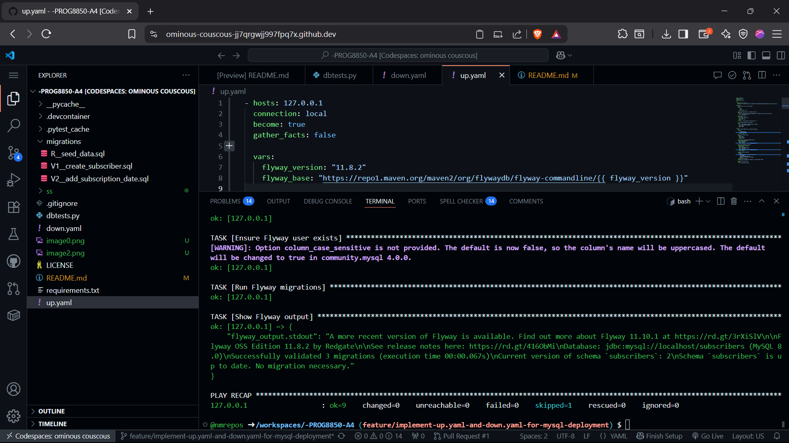
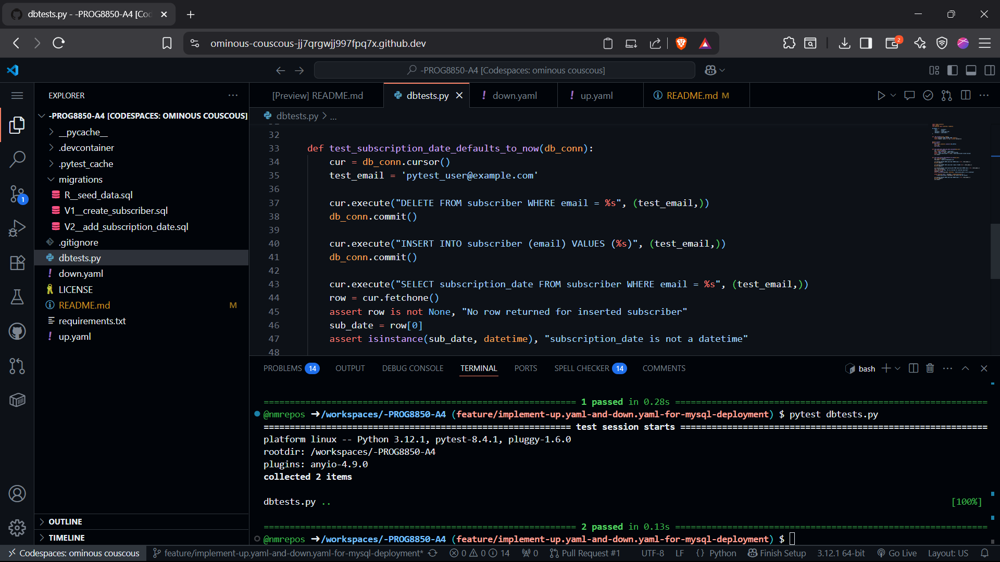
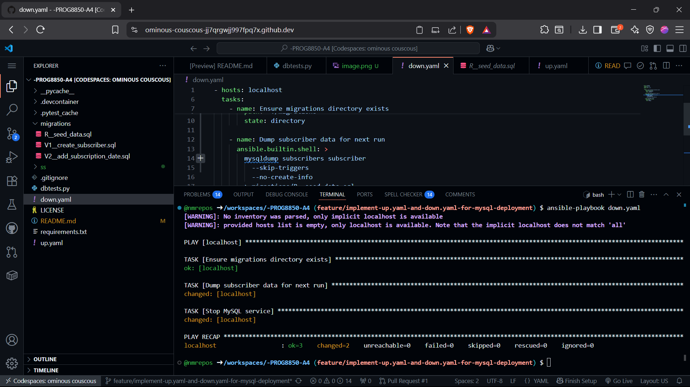

# PROG8850Template
Environment with MySQL, Python, Node and Docker.

## Quick start
```bash
pip install -r requirements.txt
sudo service mysql start
ansible-playbook up.yaml
pytest dbtests.py
```
When you are done working with the database run:
```bash
ansible-playbook down.yaml
```

To access database manually:
```bash
sudo mysql -u root
```

##  Overview

- **up.yaml** successfully installs and starts MySQL, configures Flyway CLI, and applies schema migrations idempotently.
- **down.yaml** correctly exports existing `subscriber` data into `migrations/R__seed_data.sql` and stops the MySQL service.
- **dbtests.py** validates that:
  - The `subscriber` table contains `email` and `subscription_date` columns.
  - New rows automatically receive a `CURRENT_TIMESTAMP` default for `subscription_date`.

---

## Validation Steps & Results

1. **Initial Deployment & Migration**
   - Ran `ansible-playbook up.yaml` twice; no errors on re-run.
   - Verified new column `subscription_date` added with default current timestamp.
    
    

2. **Automated Schema Tests**
   - Executed `pytest dbtests.py`:
    

3. **Data Seeding & Teardown**
   - Inserted test records; ran `ansible-playbook down.yaml`.
   - Confirmed `migrations/R__seed_data.sql` contains up-to-date INSERT statements.
   - MySQL service stopped as expected.
   

---

## 3. Conclusion

All required tasks completed and validated. The Ansible scripts and tests operate correctly and satisfy the assignment requirements.


